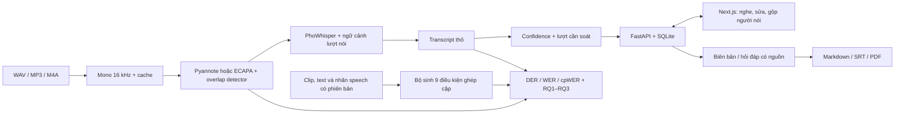

# Kiến trúc Meeting Minutes ASR

M1–M5 chạy theo stage, giải phóng model/GPU giữa các bước. Cache phụ thuộc audio, cấu hình upstream, implementation và phiên bản thư viện. Dự đoán gốc được giữ riêng với bản sửa. Một worker xử lý tuần tự; SQLite kiểm tra revision khi sửa hoặc lưu câu trả lời. Khởi động lại dùng stage đã cache.

RTTM dự đoán gốc dùng để chấm DER; nối mảnh cùng speaker trước ASR giữ thêm ngữ cảnh nhưng không thay RTTM chấm điểm. Với dữ liệu mô phỏng, speech RTTM dùng để chấm DER/overlap, utterance RTTM dùng để chạy ASR oracle, lời tham chiếu theo utterance dùng để chấm WER/RQ3. Nhãn máy và nhãn người nghe có trạng thái/provenance riêng.

Biên bản và hỏi đáp dùng transcript đã sửa, kiểm tra ID nguồn và lấy thời gian/người nói từ transcript. Đổi nội dung làm đầu ra cũ stale. ID hợp lệ chưa chứng minh một ý được nguồn hỗ trợ về nghĩa; nghiệm thu thực tế và review semantic nằm trong [ACCEPTANCE.md](ACCEPTANCE.md).

Compose chạy website và API trong cùng mạng; trình duyệt dùng `/api` qua proxy. Image web dùng Next standalone và user không phải root. API có target CPU và GPU riêng. Ứng dụng hiện phục vụ demo local, một worker; triển khai nhiều người dùng cần thiết kế thêm ownership, xác thực và điều phối worker.
